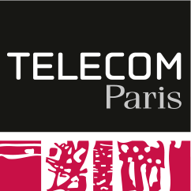
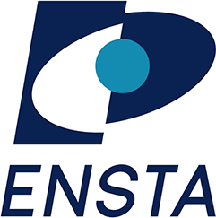

# Mouhamed Fadel Samb

**ML / AI Engineer** · Computer vision · 3D reconstruction · Robotics — Paris 🇫🇷

🥽 Interested in AR/VR and spatial computing

### 🎓 Education

  **MS in Multimodal & Autonomous AI** — Télécom Paris × ENSTA Paris 
 **Master's in Machine Learning for Data Science** — Université Paris Cité 
 **Bachelor's degree** — Université Gustave Eiffel

### 🛠️ Stack

Python · PyTorch · scikit-learn · OpenCV · ROS 2 · R · SQL

### 📫 Contact

[LinkedIn](https://www.linkedin.com/in/mouhamed-fadel-samb-5301a429b) · [Email](mailto:mouhamedfadel2001pro@gmail.com)
